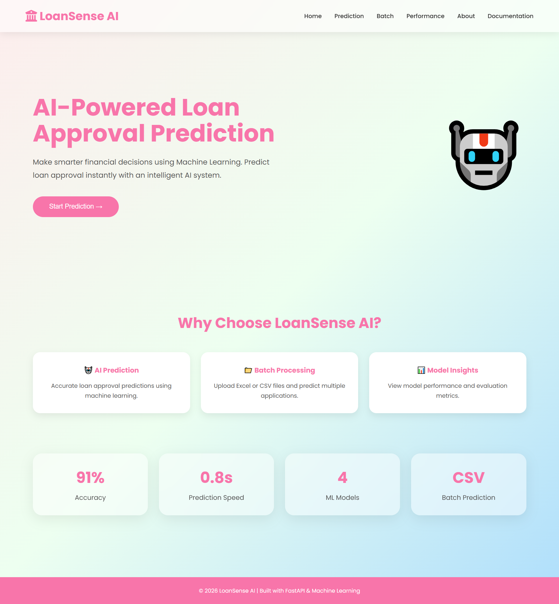
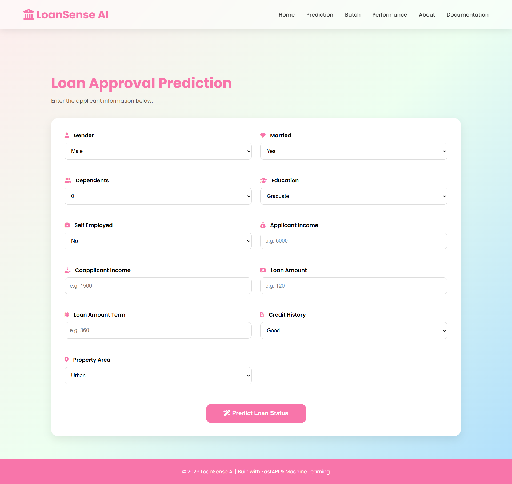
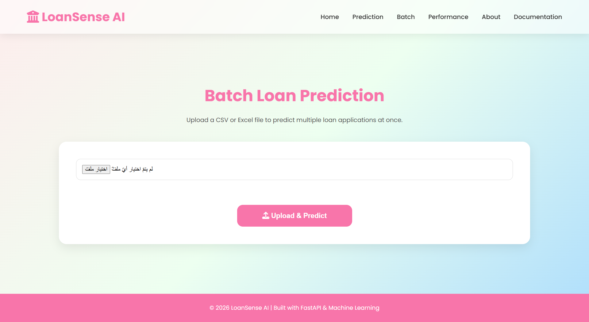
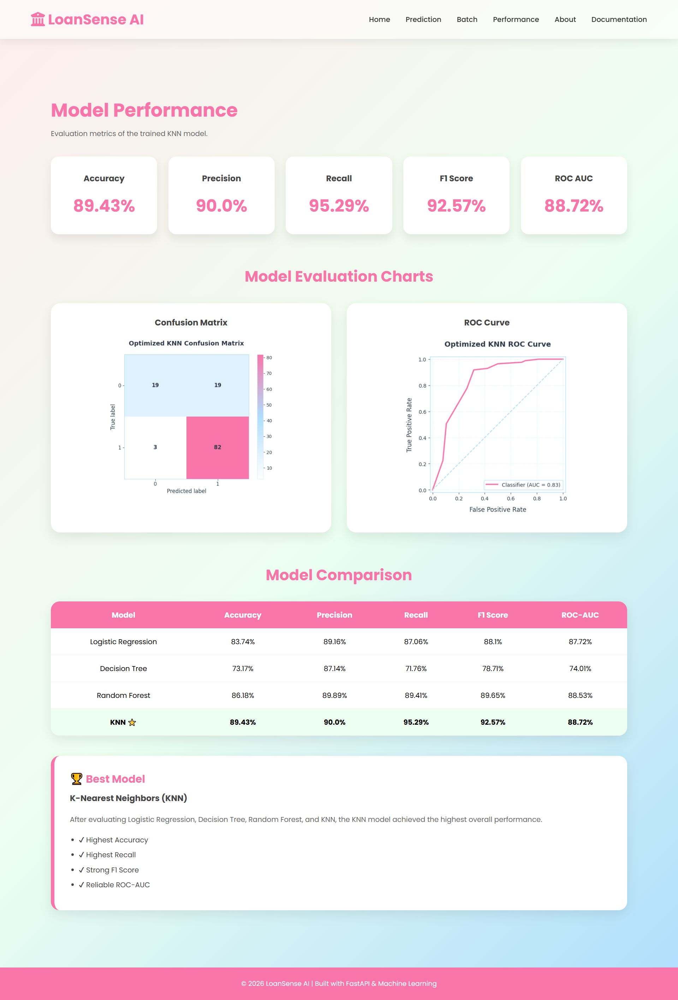
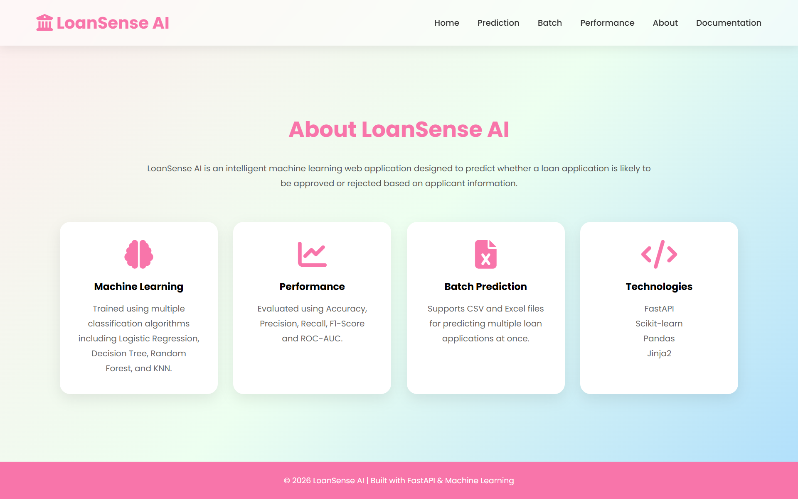

# 🏦 LoanSense AI




<p align="center">
  <strong>Machine Learning-powered Loan Approval Prediction System built with FastAPI.</strong>
</p>

---

## 🌐 Live Demo

👉 https://loansense-final.onrender.com

---

## 📖 Overview

LoanSense AI is a web application that predicts whether a loan application is likely to be **Approved** or **Rejected** using a trained Machine Learning model.

The application provides an intuitive interface for both individual predictions and batch predictions from Excel files, along with model evaluation metrics and visual performance reports.

---

## ✨ Features

- ✅ Single Loan Prediction
- ✅ Batch Prediction using Excel files
- ✅ Prediction Confidence Score
- ✅ Model Performance Dashboard
- ✅ Confusion Matrix Visualization
- ✅ ROC Curve Visualization
- ✅ Responsive User Interface
- ✅ FastAPI Backend
- ✅ Machine Learning Integration
- ✅ Cloud Deployment using Render

---

# 📸 Screenshots

## 📸 Screenshots


### 🤖 Prediction Page



---

### 📂 Batch Prediction Page



---

### 📊 Performance Dashboard



---

### ℹ️ About Page


---

### ℹ️ Documentation Page


---

# 🛠️ Tech Stack

### Backend

- FastAPI
- Python

### Machine Learning

- Scikit-learn
- Pandas
- NumPy
- Joblib

### Frontend

- HTML5
- CSS3
- Jinja2 Templates

### Deployment

- Render

---

# 📂 Project Structure

```text
LoanSense-AI/
│
├── static/
│   ├── images/
│   └── style.css
│
├── templates/
│   ├── base.html
│   ├── home.html
│   ├── prediction.html
│   ├── batch.html
│   ├── performance.html
│   └── about.html
│
├── uploads/
├── app.py
├── loan_approval_model.pkl
├── requirements.txt
├── Procfile
└── README.md
```

---

# 🤖 Machine Learning Model

The model predicts loan approval using applicant information including:

- Gender
- Marital Status
- Dependents
- Education
- Self Employment
- Applicant Income
- Coapplicant Income
- Loan Amount
- Loan Amount Term
- Credit History
- Property Area

### Engineered Features

- Total Income
- Monthly Loan Payment
- Loan Income Ratio

---

# 📈 Model Evaluation

The application includes a dedicated Performance page displaying:

- Accuracy
- Precision
- Recall
- F1 Score
- ROC AUC Score
- Confusion Matrix
- ROC Curve

---

# 🚀 Installation

Clone the repository

```bash
git clone https://github.com/dohaalnabahin/LoanSense-AI.git
```

Move into the project

```bash
cd LoanSense-AI
```

Install dependencies

```bash
pip install -r requirements.txt
```

Run the application

```bash
uvicorn app:app --reload
```

Open your browser

```
http://127.0.0.1:8000
```

---

# 🌍 Live Website

https://loansense-final.onrender.com

---

# 👩‍💻 Author

**Doha Samir Alnabahin**

GitHub

https://github.com/dohaalnabahin

LinkedIn

>https://www.linkedin.com/in/doha-samir12/

---

# 📄 License

This project was developed for educational and portfolio purposes.

---

⭐ If you found this project useful, consider giving it a star on GitHub!
